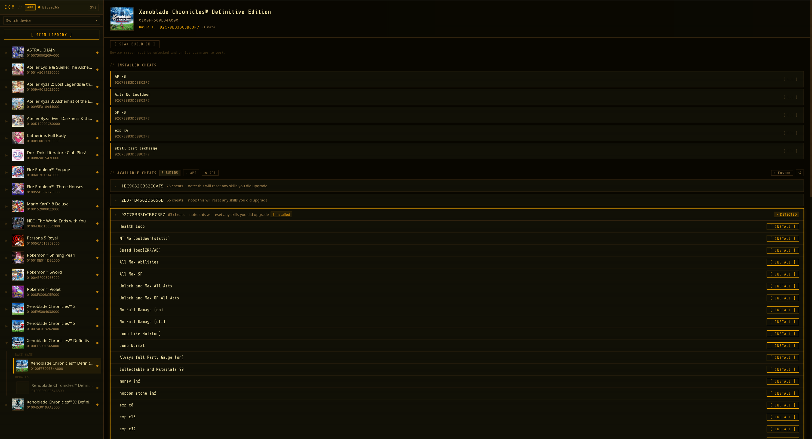
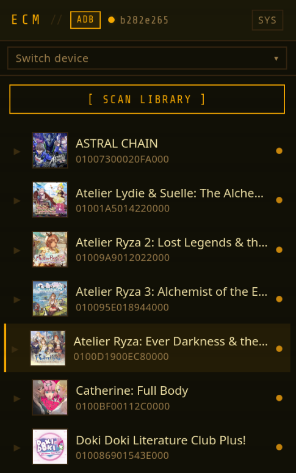
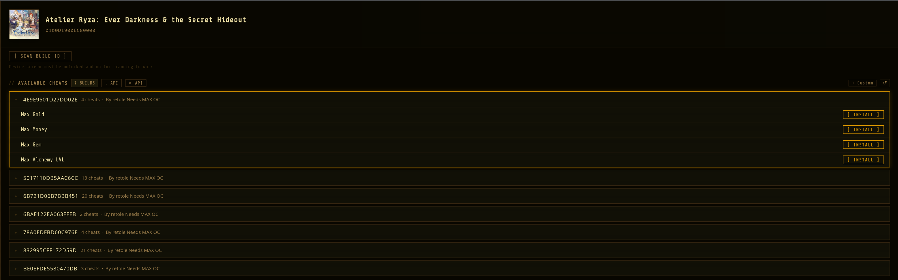
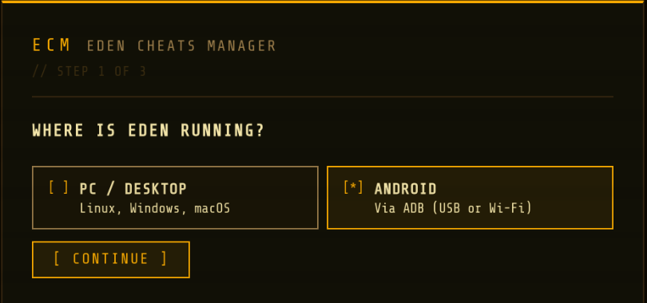

# Eden Cheats Manager

A desktop app for managing cheat codes on the [Eden](https://github.com/eden-emulator) Nintendo Switch emulator — no terminal, no hex folders, no manual file pushing.

> **Supports:** Android devices (via ADB) · PC installs (Windows / Linux / macOS)



---

## What it does

**Before:** hunt through log files by hand, create 3 levels of nested folders with exact hex names, push files over ADB one at a time.

**After:** open the app, pick a game, click Install.

| Sidebar | Cheat panel |
|---------|-------------|
|  |  |

---

## Table of contents

1. [Download & install the app](#1-download--install-the-app)
2. [Android setup — enabling ADB](#2-android-setup--enabling-adb)
3. [First launch & setup wizard](#3-first-launch--setup-wizard)
4. [Using the app](#4-using-the-app)
5. [Getting cheats from Cheatslips](#5-getting-cheats-from-cheatslips)
6. [Custom cheats](#6-custom-cheats)
7. [How cheats work (technical)](#7-how-cheats-work-technical)
8. [Troubleshooting](#8-troubleshooting)

---

## 1. Download & install the app

Go to the [Releases](../../releases) page and download the file for your operating system:

| OS | File to download |
|----|-----------------|
| Windows | `eden-cheats-manager_x.x.x_x64-setup.exe` |
| macOS (Apple Silicon) | `eden-cheats-manager_x.x.x_aarch64.dmg` |
| macOS (Intel) | `eden-cheats-manager_x.x.x_x64.dmg` |
| Linux | `eden-cheats-manager_x.x.x_amd64.AppImage` |

Run the installer, launch the app, and continue to the next section.

> **PC mode only?** If you're using Eden on PC (not Android), skip to [First launch](#3-first-launch--setup-wizard).

---

## 2. Android setup — enabling ADB

ADB (Android Debug Bridge) is how the app talks to your Android device. You only need to do this once.

### Step 1 — Enable Developer Options

1. Open your device's **Settings** app
2. Scroll down and tap **About phone** (sometimes inside "General management" or "System")
3. Find **Build number** and **tap it 7 times** in a row
4. You'll see a message: *"You are now a developer!"*

> On some devices (Samsung, Xiaomi, etc.) the location differs slightly — search "Build number" in Settings if you can't find it.

### Step 2 — Enable USB Debugging

1. Go back to **Settings** and open **Developer options** (now visible near the bottom)
2. Find **USB debugging** and turn it **ON**
3. Confirm the warning dialog

### Step 3 — Connect to your computer

**Via USB cable:**

1. Plug your device into your computer with a USB cable
2. On your device, a prompt will appear: *"Allow USB debugging?"*
3. Tap **Allow** (check "Always allow from this computer" to avoid seeing it again)

That's it — your device is ready.

**Via Wi-Fi (optional, wireless):**

1. In **Developer options**, find **Wireless debugging** and turn it **ON**
2. Tap **Wireless debugging** to open its settings
3. Note the **IP address and port** shown on screen
4. In Eden Cheats Manager → **Settings** → **Saved Connections** → add those details

### Step 4 — Install ADB on your computer (if needed)

The app uses the `adb` command-line tool. If you already have Android Studio installed it's already on your system.

If not, install it for your OS:

- **Windows:** Download [Platform Tools](https://developer.android.com/tools/releases/platform-tools) from Google, extract the ZIP anywhere, then open Eden Cheats Manager → Settings and point the ADB path to `adb.exe` inside that folder
- **macOS:** `brew install android-platform-tools`
- **Linux:** `sudo apt install adb` or `sudo pacman -S android-tools`

Leave the ADB path blank in Settings if `adb` is already available system-wide (i.e. you can type `adb` in a terminal and it works).

---

## 3. First launch & setup wizard

On first launch, a setup wizard walks you through the basics.



**Step 1 — Choose your mode:**
- **PC / Desktop** — Eden is installed on this computer. The app reads and writes cheat files directly.
- **Android (ADB)** — Eden is running on an Android device. The app communicates over ADB.

**Step 2 (Android only) — ADB path:**
Leave blank if `adb` is on your system PATH, or browse to the `adb` / `adb.exe` binary.

**Step 3 (PC only) — Eden load directory:**
The folder where Eden loads cheats from. The app tries to detect it automatically. If not found, click **[ … ]** to browse to it manually.

> **Where is the load directory?**
> - **Windows:** `%APPDATA%\Eden\load\`
> - **Linux:** `~/.local/share/eden/load/`
> - **macOS:** `~/Library/Application Support/eden/load/`

You can change any of these settings later via the **SYS** button in the top-right of the sidebar.

---

## 4. Using the app

### Scan your library

Click **[ SCAN LIBRARY ]** in the sidebar. The app scans your installed games and groups them by title (base game, updates, DLCs).

> **Android users:** make sure your device is connected and USB Debugging is on before scanning. The app will show a clear error if no device is detected — it won't try to load games from a disconnected device.

### Select a game

Click any game in the sidebar. The right panel shows:
- All available cheats from the local database
- The Build ID detected from Eden's log files (if available)
- Cheats already installed on your device / PC

### Install a cheat

1. Find the **Build ID** row that matches your game version — look for the **✓ Detected** badge
2. Click the row to expand it
3. Click **[ INSTALL ]** next to any cheat

The cheat is pushed to your device or written to your PC load directory immediately.

### Delete a cheat

Already-installed cheats appear at the top of the panel. Click **[ DEL ]** next to one to remove it.

---

## 5. Getting cheats from Cheatslips

The bundled database covers many games but is static. To get the latest cheats for any game on demand:

1. Sign up for a free account at [cheatslips.com](https://www.cheatslips.com) and copy your API token
2. Open **Settings** (top-right **SYS** button) → paste the token into **Cheatslips API Token** → Save
3. Select a game and click **↓ API** in the Available Cheats header

Fetched cheats are saved to your local database — you only use one of your **3 free daily requests** the first time. After that they load instantly from the local cache without any network request.

To remove API-fetched cheats for a game (for example to re-fetch a newer version), click **✕ API** next to the fetch button.

---

## 6. Custom cheats

Have cheat codes that aren't in any database? Click **+ Custom** in the Available Cheats header.

Enter the Build ID (pre-filled if one was detected) and paste your cheat codes in Eden's format:

```
[Cheat Name]
04000000 00C88A70 3B9AC9FF
```

Custom cheats are saved locally and appear alongside bundled cheats. Delete them per Build ID using the **[ DEL ]** button on the right side of the accordion row.

---

## 7. How cheats work (technical)

### Folder structure

Eden loads cheats from this layout on disk:

```
<load_dir>/
  └── <TitleID>/          ← 16-char hex  (long-press game → Info → Program ID)
       └── <CheatName>/   ← any name you choose
            └── cheats/
                 └── <BuildID>.txt    ← 16-char hex, version-specific
```

On Android, the load directory is:
```
/Android/data/dev.eden.eden_emulator/files/load/
```

### What is a Build ID?

When a game launches, Eden writes a line like this to its log:

```
Querying NSO patch existence for build_id=92C78BB3DCBBC3F7..., name=main
```

The **first 16 characters** (`92C78BB3DCBBC3F7`) are the Build ID. Cheats are tied to a specific game version — a game update changes the Build ID, which means existing cheats stop working until new codes are written for the updated version.

### Scan Build ID (Android)

If the Build ID isn't detected automatically from Eden's existing logs, use **[ SCAN BUILD ID ]**. The app will:

1. Find the ROM file on your device
2. Force-stop Eden for a clean state
3. Launch Eden's main screen and wait for it to load
4. Launch the game
5. Read the Build ID from Eden's log
6. Force-stop Eden and return the result

> The device screen must be **unlocked and on** for this to work. It takes up to 90 seconds depending on the game.

---

## 8. Troubleshooting

**Build ID not detected**
> Launch the game in Eden at least once to generate a log entry, then click Detect Build IDs or Scan Build ID.

**"No device connected" when scanning**
> Make sure USB Debugging is enabled, the cable is plugged in, and you tapped **Allow** on the "Allow USB debugging?" prompt on your device.

**Scan Build ID fails or times out**
> - Device screen must be unlocked and on
> - The game must be in a directory configured in Eden's settings
> - If the game is on an SD card, Eden must have storage access permission for that card

**Cheat doesn't appear in Eden after installing**
> In Eden: long-press the game → Add-ons → Install → navigate to the folder *containing* `cheats/` (not `cheats/` itself).

**Cheat shows in Eden but doesn't work**
> The codes may target a different game version — memory addresses change with updates. Confirm the Build ID matches your exact installed version.

**↓ API returns far more cheats than expected**
> Normal — Cheatslips stores one entry per contributor per Build ID, and contributors often bundle many codes into one submission. Use **✕ API** to clear and re-fetch if needed.

---

## Build from source

**Prerequisites:** [Rust](https://rustup.rs) · [Node.js](https://nodejs.org) · [ADB](https://developer.android.com/tools/adb) (Android mode only)

```bash
git clone https://github.com/ChrisA95G/eden-cheats-manager
cd eden-cheats-manager/gui
npm install
npm run tauri build
```

---

## File locations

| What | Where |
|------|-------|
| App settings & cached DB | Platform app data directory |
| Android cheat storage | `/Android/data/dev.eden.eden_emulator/files/load/` |
| Eden logs (Android) | `/Android/data/dev.eden.eden_emulator/files/log/` |

---

## License

MIT © 2026 — see [LICENSE](LICENSE)
